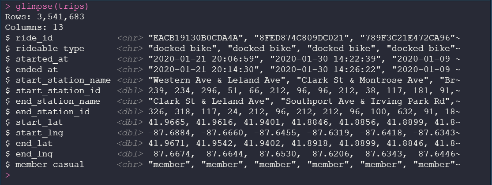

# Cyclistic Bike-Share Analysis
*"How Does a Bike-Share Navigate Speedy Success?"*  
Ginanjar Saputra, 13 June 2021

# Introduction
Cyclistic is a company offering a bike-share program. First launched in 2016, it has now grown to a fleet of 5,824 bicycles that are geotracked and locked into a network of 692 stations across Chicago. The bikes can be unlocked from one station and returned to any other station in the system anytime.

Cyclistic customer base (or ridership) is categorized into two types.

1. **Casual riders**: customers who purchase single-ride or full-day passes
2. **Members**: customers who purchase annual memberships.

According to Cyclistic's finance analysts, annual members are much more profitable than casual riders. The director of marketing, Lily Moreno, has set a goal to design marketing strategies aimed at converting casual riders into members. She believes that maximizing the number of annual memberships will be key to Cyclistic's future growth. In order to achieve the goal successfully, the marketing analytics team needs to better understand how members and casual riders differ.

**Business Task**  
Analyzing past trips data to identify trends and understand how casual riders and members use Cyclistic bikes differently. Insights from the analysis will be used to design marketing strategies aimed at converting casual riders to annual members.

**Stakeholders**  
The key stakeholders in this analysis project are the Cyclistic marketing analytics team, Lily Moreno (the marketing director), and the executives of Cyclistic.

# Data
Cyclistic historical trip data between January and December 2020 are used for the purpose of the analysis, downloaded from [Divvy Data](https://www.divvybikes.com/system-data). The data are provided by Motivate Inc. and has been made available to the public.

According to the [data license agreement](https://www.divvybikes.com/data-license-agreement), the data may be used “as source material, as applicable, in analyses, reports, or studies published or distributed for non-commercial purposes”. Data-privacy issues prohibit the “attempt to correlate the data with names, addresses, or other information of customers”.

The data are stored as compressed CSV (comma-separated values) files. In terms of convention, trip data for the year 2020 is inconsistent: the files are organized by quarter only for the first three months (Jan-Mar), while the rest are organized by month. Each of these CSV files contains hundreds of thousands of data rows for variables such as ride ID; bike type; ride timestamps; names, ID, geographical coordinates of docking stations; and membership status of the users. Column names are described in the table below.

 No | Column             | Description
 ---|--------------------|------------
 1  | ride_id            | Unique identifier of each ride
 2  | rideable_type      | Type of bike (classic, electric)
 3  | started_at         | Timestamp of when a ride started
 4  | ended_at           | Timestamp of when a ride ended
 5  | start_station_name | Name of docking station where a ride started
 6  | start_station_id   | ID of docking station where a ride started
 7  | end_station_name   | Name of docking station where a ride ended
 8  | end_station_id     | ID of docking station where a ride ended
 9  | start_lat          | Latitude at the start of a ride
 10 | start_lng          | Longitude at the start of a ride
 11 | end_lat            | Latitude at the end of a ride
 12 | end_lng            | Longitude at the end of a ride
 13 | member_casual      | Whether user is a member or a casual rider

# Data Processing
Considering the size of the data sets, R programming language and RStudio are chosen to prepare and process the data. In the processing stage, cleaning and transformation are performed on the data so that it is appropriate for analysis.

**Merging Data**  
After loading the CSV files into RStudio environment, the separate data sets are merged. The merging results in a single data frame with 13 columns and 3.5+ million rows. Merging is performed in order to streamline data cleaning, i.e., to avoid repeating the same process on different data sets. For a successful merge, column names and data types are ensured to match across the data sets.

**Checking for Nulls (Missing Values)**  
There are four columns containing nulls and two of which are over 160,000 (about 5% of the data): `start_station_id`, `end_station_id`, `end_lat`, `end_lng`. The station id columns are later dropped from the data frame.

**Creating Columns for Derived Values**  
The following columns are created to enrich the data that can be used in the analysis. These new columns are populated with values derived from existing ones.

- `day_of_week` : day of the week (Mon, Tue, etc.), extracted from `started_at`
- `ride_minutes` : time difference (in minutes) between `started_at` and `ended_at`
- `season` : season of the year, derived from `started_at` using `case_when()`

**Filtering Incorrect Values**  
Rows with negative values in the column `ride_minutes` are filtered out. The following entries are removed from `start_station_name` because they represent a time when a bike was taken out for quality checks and not for an actual ride.

- "HQ QR"
- "WATSON TESTING - DIVVY"
- "HUBBARD ST BIKE CHECKING (LBS-WH-TEST)"

Entries containing empty strings and whitespaces are also filtered out from `start_station_name`.

**Dropping Columns and Rows**  
The columns `ride_id`, `start_station_id` and `end_station_id` are dropped from the data frame, given that they are unique identifiers and do not provide much insight. Moreover, the station id columns contained many nulls. Only starting stations will be considered in analyzing the location data, therefore `end_station_name`, `end_lat`, `end_lng` are dropped.

Two final data frames are output from the processing phase:

1. `trips_clean` (7 columns), contain 3.3+ million rows of trip data that have been cleaned and transformed.
2. `station_coord` (5 columns), contain 200 top stations (based on total rides started) and their coordinates.

# Analysis and Key Findings
**Ridership Proportion**

More than half of Cyclistic users had chosen the annual membership option. Casual riders (i.e., target of the marketing strategies) take up about 38% of the customer base.

**Daily and Monthly Rides**

  

As shown in the two plots above, the total number of rides peaks significantly in the summer months and is at the lowest from winter through early spring. This is true for both casual riders and members. The highest number of rides is recorded in August (600,000+), which is eight times greater than that of April's.

Cyclistic members largely dominate use of the service throughout the year, contributing to more than 50% of total rides every month. Casual riders had less than 10% share of total rides at the start of the year but rose to over 45% in the summer, giving an almost equal proportion between ridership.

  

Looking at rides by day of the week, we see that total rides increases during the weekend, especially on Saturday. Members are more consistent in their use of Cyclistic during weekdays than casual riders, with 60-70% of total rides per day. During the weekend, casual riders increase their riding activity by 20%.

**Rides Duration**  
Comparing the distribution (or size of the box plots), we see that casual riders have longer and more variable rides duration: about twice as long than members do. The median duration is 22 minutes for casual riders and 11 minutes for members. For casual riders, 75% of the rides are under 42 minutes and. For members, 75% are under 19 minutes.

Both of the plots show positive skewness, indicated by the mean that is greater than the median. Mean ride length is 42 minutes for casual riders and 19 minutes for members. This skewness is largely caused by the presence of outliers: rides duration that are relatively very long.

  

Throughout the week, members take relatively shorter rides than casual riders. Based on median ride length, casual riders take 20 minute rides on weekdays and an additional 5 minutes on weekends. Members spend around 11 minutes riding on weekdays, increasing only slightly on weekends. Based on seasonal median, longer rides are taken by casual riders in the spring (26 minutes) and the duration keeps decreasing over the next seasons.

**Rideables**  
While there is a clear preference for classic bike within the members, the ride length does not seem to be greatly affected by the type of rideables. Casual riders, on the other hand, favor electric bike and tend to take longer rides with it on the weekends. 

  

**Location**  
The map below displays 200 stations with the highest number of rides started. The purple circles represent casual riders, and the pink represent members. Radius of the circles illustrate the total rides starting out from a particular station.

As shown on the map, members are clustered further inland, beginning their rides on docking stations located within the city. Casual riders, on the other hand, tend to start their rides on stations closer to the coastal area.

# Conclusion
On the basis of the findings, two conclusions regarding the difference between Cyclistic's casual riders and annual members can be drawn.

1. Casual riders use Cyclistic bikes for a longer duration and ride more frequently on the weekends and warmer seasons. They favor electric bikes and docking stations located close to the lake. These riding patterns suggest that casual riders have a leisure-oriented use of Cyclistic.

2. Users with annual membership, on the other hand, appear to have a more practical use of the bike-share service. They ride more frequently and consistently throughout the weekdays, taking shorter rides and preferring classic bikes. They start their rides from stations located further within the city.

The following recommendations are proposed for the development of marketing strategies targeted at converting casual riders to annual members:

1. Create seasonal campaigns, e.g., promotional deals for membership sign-up during the peak months (July, August) or on weekends.
2. Offer discounts for shorter rides on weekdays during work commuting hours.
3. Investigate whether adding more docking stations within the city would boost membership sign-ups.
